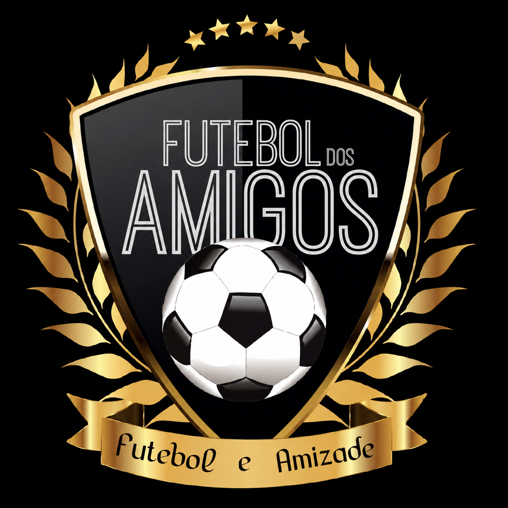

  

<h1 align="center">⚽ Futebol Quarta-Feira Playball 2 Pompeia</h1>

  <b>🏆 Aqui é raça, resenha e zero compromisso com a tática.</b>

<h2 align="center">QUEM VENCERÁ O TROFÉU BAGRE D'OR? 🐟</h2>

---

## Chegou o painel oficial da resenha

Fechou, mermão! Toda quarta a gente joga, xinga, ri e esquece o placar no dia
seguinte. Isso acabou. Agora **cada gol, assistência, vitória e derrota fica
registrado** - e vira estatística de verdade, com site, ranking e tudo.

**Objetivo do projeto:** descobrir quem é o Messi, o Neymar e o CR7 do grupo
- mas também apontar os bagres de cada rodada: Rony Rústico, Robinho Jr. e
Memphis Depay.

## O que dá pra ver no site

- **📅 Visão da Rodada** - escolhe a rodada e vê o placar daquele dia:
  classificação, artilheiro e garçom de assistências da quarta.
- **🏆 Visão Geral** - a classificação acumulada da temporada inteira: quem
  lidera, quem é o artilheiro geral, quem é o garçom de assistências geral,
  ranking Top 20 de gols e assistências, gráfico de pizza da fatia de gols de
  cada um e o comparativo de vitórias/empates/derrotas.
- **🥇🥈🥉 Medalhas de verdade** - ouro, prata e bronze pros 3 primeiros
  colocados em cada ranking, na cara.
- **🐟 Bagre Score** - o contraponto necessário: os 3 últimos colocados de
  cada rodada e do geral, com o troféu "Bagre D'Or" e tudo. Ninguém escapa.
- **📄 Baixar em PDF** - quer guardar ou mandar pro grupo? Um clique baixa
  tudo em PDF: classificação, bagres e os gráficos, prontinho.

## Como isso fica atualizado sozinho

Sem ninguém precisando mexer em nada além da planilha:

1. Depois de cada quarta, alguém preenche o resultado numa **planilha
   compartilhada no Google Drive**.
2. O site **lê essa planilha automaticamente** e se atualiza sozinho em até
   5 minutos.
3. Tem até um backup automático rodando toda semana, então os dados nunca se
   perdem.

Ou seja: bola rolou, resultado anotado, o site já reflete. Ninguém precisa
avisar ninguém.

## 🔗 Acessa aqui

> **[COLOQUE AQUI O LINK DO SITE PUBLICADO]**

---

  <b>🏆 Aqui é raça, resenha e zero compromisso com a tática.</b> 
  <b>QUEM VENCERÁ O TROFÉU BAGRE D'OR?</b>

<i>Desenvolvido por Gabriel Biroli</i>

